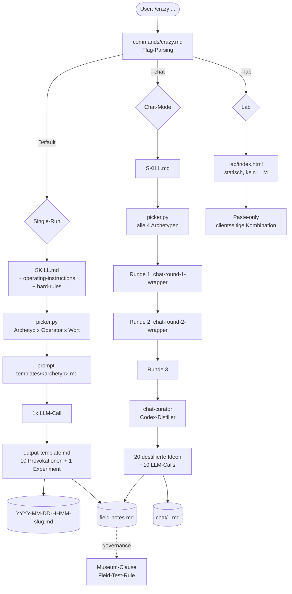
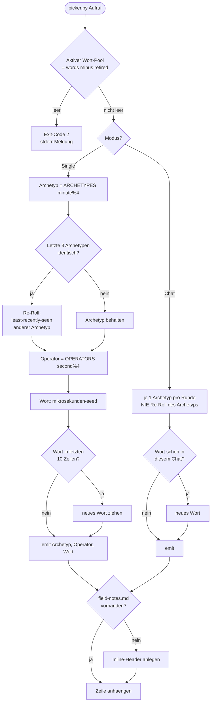
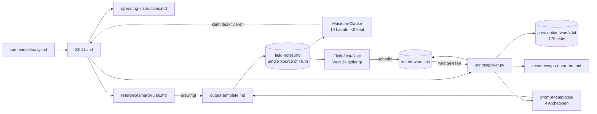

# crazy-professor — Deep Analysis & Expansion Report

**Analyse-Datum:** 2026-06-03
**Analysiertes Release:** v0.13.0
**Repo:** `dynamic-dome/crazy-professor`
**Methodik:** Vollständige Lektüre des Repos (Docs, Commands, Skill, Prompt-Templates, Resources, `picker.py`, Lab-HTML, Manifeste) + empirische Tests von `picker.py` + externer Literaturvergleich. Jede Aussage über den Code ist mit einem Dateipfad belegt.

---

## Executive Summary

crazy-professor ist ein **Divergenz-Generator** für Claude Code — kein Berater, kein Coach. Das ist die zentrale, konsequent durchgehaltene Designentscheidung: Der Skill produziert pro Lauf zehn „seltsame, aber verankerte" Provokationen aus der Kombination **Archetyp × Provokationswort × de-Bono-PO-Operator** und endet mit genau einem konkreten nächsten Experiment. Output ist niemals ein Ratschlag (`skills/crazy-professor/references/hard-rules.md`, Hard Rule „output-is-never-advice").

Das Projekt ist **konzeptuell außergewöhnlich kohärent** und in der Voice-Gestaltung handwerklich stark. Die vier Archetypen sind nicht nur Tonalitäts-Tapeten, sondern durch **verbotenes Vokabular**, Pflicht-Vokabeln und (bei `radagast-brown`) bindende „Activation Amendments" mechanisch voneinander abgegrenzt. Die Selbst-Governance (Museum-Clause, Field-Test-Rule, Review-Rubrik) ist ein echtes, ehrliches Anti-Bullshit-Konstrukt — kein Dekor.

Die **größte Stärke ist gleichzeitig die größte Spannung**: v0.13.0 ist ein radikaler Rückbau, der die Phasen 4–8 (Telemetrie, Patch-Suggester, Linter, Eval-Suite, Telegram, Browser-Playground) gestrichen hat, weil sie „vor dem Datenstrom gebaut" wurden (`docs/CHANGELOG.md`). Dieser Rückbau ist **Disziplin, nicht Panik** — aber er hat **Doku-Leichen** hinterlassen: tote Referenzen auf gelöschte Dateien und Telemetrie-Konzepte, die im laufenden Skill noch erwähnt werden.

`picker.py` (`skills/crazy-professor/scripts/picker.py`, stdlib-only, 261 LOC) ist sauber, deterministisch genug und in den getesteten Edge-Cases (leerer Pool, erschöpfter Pool, Chat-Dedup, Auto-Init der Field-Notes) **empirisch korrekt**. Es gibt einen redundanten Guard-Check und eine vereinfachte Operator-Verteilung, aber keine funktionalen Bugs.

**Wichtigste externe Korrektur:** Das Repo zitiert dreimal „Persona-Prompting kann bis zu **30 Prozentpunkte** Genauigkeit kosten (Search Engine Journal, 2024)". Die zugrundeliegende Quelle berichtet tatsächlich einen Rückgang von **71,6 % → 68,0 %** (≈ 3–5 pp) auf MMLU, und sie ist von **2026**, nicht 2024 ([Search Engine Journal](https://www.searchenginejournal.com/research-you-are-an-expert-prompts-can-damage-factual-accuracy/570397/)). Die Stoßrichtung des Arguments (Persona schadet Faktentreue, hilft Stil/Alignment) ist korrekt belegt — die konkrete Zahl „30pp" und das Jahr sind es nicht.

**Gesamturteil:** Ein reifes, philosophisch diszipliniertes Mini-Projekt mit einem hervorragenden konzeptuellen Kern und einigen kosmetischen Doku-Schulden. Der ehrlichste Skill, den man bauen kann — und genau deshalb verdient er eine präzise Bereinigung statt neuer Features.

---

## Phase 1 — System-Verständnis

### 1.1 Was crazy-professor ist (und bewusst nicht ist)

crazy-professor ist als **Lateral-Thinking-Maschine** konzipiert. Er nimmt ein Problem entgegen und antwortet mit absichtlich verstörenden, aber an das Problem rückgebundenen Provokationen. Die Verankerung ist Pflicht: Hard Rule „anchor-or-doesnt-count" verlangt, dass jede Provokation einen erkennbaren Bezug zum Ausgangsproblem hat, sonst zählt sie nicht (`skills/crazy-professor/references/hard-rules.md`). Der Skill ist explizit **kein Advisor** — er verbietet sich Empfehlungen, Bewertungen und Lösungs-Pitches (Hard Rule „output-is-never-advice").

### 1.2 Die drei Run-Modi

| Modus | Trigger | Archetypen | Output | LLM-Calls | Dauer |
|---|---|---|---|---|---|
| **Single-Run** (Default) | `/crazy <problem>` | 1 (per Picker gezogen) | 10 Provokationen + 1 Next-Experiment | 1 | ~30 s |
| **Chat-Mode** | `/crazy --chat <problem>` | alle 4 (je einer/Runde) | 3 Runden → 20 destillierte Ideen (Codex-Distiller) | ~10 | 2–4 min |
| **Lab** | `/crazy --lab` | — (kein LLM) | statisches Browser-HTML, Paste-only | 0 | sofort |

Quellen: `commands/crazy.md`, `docs/CAPABILITIES.md`, `docs/chat-mode-flow.md`, `skills/crazy-professor/lab/index.html`.

Der **Single-Run** ist der Normalfall: ein Archetyp, ein LLM-Call, schnelle Divergenz. Der **Chat-Mode** ist die teure, tiefe Variante — alle vier Archetypen laufen über drei Runden, ein Curator/Distiller (`chat-curator.md`) destilliert die Rohmenge auf 20 Ideen. Das **Lab** (`skills/crazy-professor/lab/index.html`) ist der bewusst LLM-freie Fallback: ein statisches HTML, in das man Text einfügt und das clientseitig Kombinationen würfelt — null Kosten, null Modell.

### 1.3 Datenfluss

```
/crazy <problem>
   → command (commands/crazy.md) parst Flags, lädt SKILL.md
   → SKILL.md lädt operating-instructions + hard-rules
   → picker.py zieht (Archetyp, Operator, Wort) + Variation-Guard
   → Prompt-Template des Archetyps wird gefüllt
   → LLM erzeugt 10 Provokationen + 1 Experiment (output-template.md)
   → Lauf wird als Markdown-Datei persistiert
   → Zeile wird an field-notes.md angehängt (Single Source of Truth)
   → nach N Läufen: Museum-Clause / Field-Test-Rule werten field-notes.md aus
```

### 1.4 Persistenz-Modell

Die **einzige maschinenlesbare Lauf-Historie** ist `field-notes.md`, gespeichert **im Ziel-Projekt** unter `.agent-memory/lab/crazy-professor/field-notes.md` (nicht im Plugin-Repo). Es ist eine **append-only Markdown-Tabelle mit 12 Spalten**, in der Single- und Chat-Läufe gemischt protokolliert werden (`skills/crazy-professor/resources/field-notes-schema.md`).

- Single-Outputs → `.agent-memory/lab/crazy-professor/YYYY-MM-DD-HHMM-<slug>.md`
- Chat-Outputs → `chat/`-Unterordner

`picker.py` legt bei fehlender `field-notes.md` automatisch einen Inline-Header an (empirisch verifiziert, siehe Phase 2.4) — es braucht **kein** separates Init-Template, obwohl die Doku noch eines referenziert.

### 1.5 Die vier Archetypen

Quelle: `skills/crazy-professor/prompt-templates/`.

| Archetyp | Mechanik | Pflicht | Verbotenes Vokabular |
|---|---|---|---|
| **first-principles-jester** | 3-teilig: Zerlegung → Illegalisierung von Konventionen → Re-Kombination | erst zerlegen, dann verbieten | — |
| **labyrinth-librarian** | importiert Mechanismen aus fremden Fachgebieten | muss im **fremden** Fachgebiet eröffnen | System-/Flow-Begriffe |
| **systems-alchemist** | Flow-/Reaktor-Mapping des Problems | ≥ 3 System-Begriffe im **ersten** Satz | Fremdfeld-Zitate |
| **radagast-brown** | Fürsorge-/Schutz-Stimme | ≥ 2 Natur-Pflicht-Vokabeln im **ersten** Satz | (siehe Activation Amendments) |

Die Archetypen sind **gegenseitig kontaminationsfrei** zu halten (Hard Rule „no-cross-archetype-contamination") — ein labyrinth-librarian darf nicht in System-Sprache verfallen, ein systems-alchemist nicht ins Fremdfeld-Zitieren.

### 1.6 radagast-brown & die Activation Amendments

`radagast-brown` ist der am stärksten regulierte Archetyp, weil seine „Fürsorge"-Stimme am leichtesten in verkappte Optimierung kippt. Die **Activation Amendments** (`prompt-templates/radagast-brown.md`) sind bindend:

1. **Strenger Erster-Satz-Vokabel-Zwang** (≥ 2 Natur-/Schutz-Wörter im ersten Satz)
2. **Kein Fremdfeld-Schmuggel** (kein Importieren von Mechanik aus anderen Disziplinen — das ist der Job des librarian)
3. **`[opt-care]`-Marker**: Wenn Optimierung als Fürsorge getarnt wird, muss sie als `[opt-care]` markiert werden
4. **Max. 1 Ordner/Lauf** (Begrenzung der Verschachtelung)
5. **Repetition-Watch** (Wiederholungs-Selbstkontrolle)

Diese Amendments sind der Beweis, dass die Voice-Gestaltung **mechanisch** und nicht bloß stilistisch gedacht ist.

### 1.7 PO-Operatoren

`skills/crazy-professor/resources/po-operators.md` definiert **vier** aktive Operatoren: `reversal`, `exaggeration`, `escape`, `wishful-thinking`. Zwei weitere (`distortion`, `arising`) sind für V2 reserviert. Das deckt sich direkt mit de Bonos kanonischer Liste „escape, reversal, exaggeration, distortion, and wishful thinking" ([deBono](https://www.debono.com/serious-creativity-article)).

### 1.8 Selbst-Governance

Quelle: `skills/crazy-professor/references/hard-rules.md`.

- **6 Hard Rules:** output-is-never-advice, warning-banner, goal-respect, anchor-or-doesnt-count, exactly-one-experiment, no-cross-archetype-contamination.
- **Museum-Clause:** Nach dem 10. Lauf — wenn < 3 Outputs als „kept" markiert wurden — wandert der Skill ins Museum (= wird ausgemustert).
- **Chat-Mode Museum-Clause:** analog mit 5-Lauf-Gate.
- **Field-Test-Rule:** Wird ein Provokationswort 3× geflaggt, wandert es nach `retired-words.txt`.
- **Review-Rubrik:** Bewertung nach Wert / Umsetzbarkeit / System-Fit; Verdikte `kept` / `conditional` / `backlog`.

---

## Phase 2 — Bewertung (das Herzstück)

### 2.1 Konzeptionelle Kohärenz — sehr hoch

Die zentrale Designentscheidung — „Divergenz-Generator, niemals Berater" — ist über **jede Schicht** des Systems hinweg konsequent durchgezogen, und das ist selten. Die Hard Rule „output-is-never-advice" (`references/hard-rules.md`) ist nicht nur eine Deklaration, sondern wird im `output-template.md` durch einen **Warning-Banner** verstärkt (Hard Rule „warning-banner") und durch die Persona-Drift-Begründung legitimiert (`resources/output-template.md`, Zeile 64–65). Das ist das seltene Phänomen eines Projekts, dessen Philosophie tatsächlich in die Mechanik eingegossen ist und nicht nur im README behauptet wird.

Die **Verankerungs-Pflicht** („anchor-or-doesnt-count") ist die intellektuell sauberste Entscheidung des Projekts: Sie verhindert das Hauptversagen aller Random-Provokations-Tools — beliebigen Nonsens, der zwar überraschend, aber unbrauchbar ist. de Bono selbst betont, dass „Provocation without movement is useless" ([deBono](https://www.debono.com/serious-creativity-article)); crazy-professor codiert genau diese „Movement"-Forderung als nicht verhandelbare Regel.

### 2.2 Voice-Design-Qualität — exzellent

Die Trennung der vier Archetypen über **verbotenes Vokabular** ist der klügste Mechanismus im Projekt. Statt zu hoffen, dass das LLM „im Charakter bleibt", werden Anti-Patterns explizit verboten: Der `labyrinth-librarian` darf keine System-Begriffe verwenden, der `systems-alchemist` keine Fremdfeld-Zitate (`prompt-templates/labyrinth-librarian.md`, `prompt-templates/systems-alchemist.md`). Das macht die Differenzierung **prüfbar** statt nur erhofft — ein Reviewer (oder ein künftiger Linter) kann objektiv feststellen, ob ein Output kontaminiert ist.

Die **radagast-brown Activation Amendments** (`prompt-templates/radagast-brown.md`) sind das Glanzstück. Der `[opt-care]`-Marker ist eine bemerkenswert ehrliche Konstruktion: Er erzwingt nicht das Verschwinden von verkappter Optimierung, sondern ihre **Sichtbarmachung**. Das ist intellektuell überlegen, weil es anerkennt, dass die Fürsorge-Stimme immer in Optimierung kippen *will*, und diesen Drift auf die Oberfläche zwingt, statt ihn naiv zu verbieten.

**Kritik:** Die Voice-Verträge leben seit v0.13.0 ausschließlich als **Prosa in den Prompt-Templates** — der Voice-Linter wurde zurückgebaut (`docs/ARCHITECTURE.md`, Zeile 121). Damit ist die Vokabular-Disziplin ein **Soll-Vertrag ohne Durchsetzung**: Sie verlässt sich vollständig darauf, dass das LLM die Verbote befolgt. Das ist für v0.13.0 (Lean-Scope) vertretbar, aber es ist die offensichtlichste Stelle, an der „dokumentierte Regel" und „durchgesetzte Regel" auseinanderfallen.

### 2.3 Selbst-Governance — echte Mechanismen, nicht dekorativ

Die Frage „echte Mechanismen oder Dekor?" lässt sich klar beantworten: **echt — mit einer Einschränkung.**

**Museum-Clause:** Der Mechanismus ist real und scharf. „Nach 10 Läufen, wenn < 3 kept → Museum" (`references/hard-rules.md`) ist ein **selbstabschaltender Skill** — ein Projekt, das bereit ist, sich selbst für tot zu erklären, wenn es seinen Wert nicht beweist. Das ist die ehrlichste Governance-Konstruktion, die man bauen kann, und sie ist datengetrieben an `field-notes.md` gekoppelt. Sie ist **nicht** dekorativ, weil sie auf der einzigen maschinenlesbaren Datenquelle des Systems operiert.

**Field-Test-Rule:** Ebenfalls real („Wort 3× geflaggt → `retired-words.txt`", `references/hard-rules.md`). Empirisch verifiziert: `picker.py` liest `retired-words.txt` und schließt diese Wörter aus dem aktiven Pool aus (siehe Phase 2.4). Der aktive Pool beträgt aktuell 176 Wörter (`resources/provocation-words.txt`), `retired-words.txt` ist leer — d. h. der Mechanismus ist verdrahtet, aber noch nie ausgelöst worden.

**Die Einschränkung:** Beide Clauses hängen davon ab, dass Menschen Outputs als „kept" markieren und Wörter flaggen. Das ist ein **menschlicher Kuratierungs-Akt**, kein automatischer. Bei „18 Läufen total" (`docs/CHANGELOG.md`) ist die Stichprobe noch zu klein, um zu wissen, ob die Schwellen (3 von 10, 3 Flags) kalibriert sind. Die Mechanik ist vorhanden; ihre **Kalibrierung ist unbewiesen**.

### 2.4 Der v0.13.0-Rückbau — Disziplin, nicht Panik

Die Frage „Disziplin oder Panik?" ist die interessanteste des ganzen Reviews, und die Antwort ist eindeutig **Disziplin**.

Die Begründung im Changelog ist bemerkenswert selbstkritisch: „18 Läufe total, 0 Telemetrie-Records, 0 Patch-Suggestions, 0 Telegram-Dialoge — Phase 4–8 wurde gebaut, bevor Phase 1–3 einen Datenstrom produziert hat" (`docs/CHANGELOG.md`). Das Projekt benennt seinen eigenen Fehler präzise als **„Master-Plan-Drift mit geplanter Phasen-Erfüllung als Selbstzweck"**. Das ist keine Panik-Reaktion auf einen Bug oder einen Ausfall — es ist die nüchterne Erkenntnis, dass Infrastruktur (Telemetrie, Linter, Eval-Suite) **vor** der Datenquelle gebaut wurde, die sie auswerten sollte. Ein Patch-Suggester ohne Patches, ein Telemetrie-Linter ohne Telemetrie.

Das ist exakt dieselbe Disziplin, die die Museum-Clause kodifiziert: „Beweise deinen Wert mit Daten, bevor du dich vergrößerst." Der Rückbau ist die **Anwendung der eigenen Governance-Philosophie auf das eigene Roadmap-Verhalten** — und das ist intellektuell konsistent, nicht panisch. Panik hätte den ganzen Skill gelöscht; Disziplin hat den Kern (Single-Run, Chat, Lab, Picker, Governance) behalten und die spekulative Infrastruktur entfernt.

**Aber:** Disziplinierter Rückbau ist nicht dasselbe wie *sauberer* Rückbau. Der Rückbau hat **Doku-Leichen** hinterlassen (siehe 2.6).

### 2.5 Technische Bewertung von picker.py

Quelle: `skills/crazy-professor/scripts/picker.py` (261 LOC, nur Standardbibliothek). Empirisch getestet in `/tmp/cp`.

**Determinismus-Modell:**
- Archetyp = `ARCHETYPES[minute % 4]`
- Operator = `OPERATORS[second % 4]`
- Wort = mikrosekunden-geseedet aus dem aktiven Pool

Das ist **zeitbasiert deterministisch** — bei gleichem Zeitstempel gleiches Ergebnis. Das ist eine pragmatische Wahl: Sie braucht keinen persistenten RNG-State, hat aber die Eigenheit, dass zwei Läufe in derselben Minute denselben Archetyp ziehen (was der Variation-Guard abfängt).

**Variation-Guard (verifiziert korrekt):**

| Test | Erwartung | Ergebnis |
|---|---|---|
| 3× radagast-Streak | Re-Roll auf least-recently-seen anderen Archetyp | ✅ → `first-principles-jester`, `re_rolled: archetype` |
| Wort-Fenster (letzte 10 Zeilen) | Dedup, kein Wort doppelt | ✅ |
| Leerer/voll-retirter Pool | sauberer Abbruch | ✅ Exit-Code 2 + stderr-Meldung |
| Fehlende field-notes.md | Auto-Init | ✅ Inline-Header erzeugt, kein Template nötig |
| Chat-Mode | 4 verschiedene Picks, Intra-Chat-Dedup | ✅ `re_rolled_aggregate: no/word/no/no` |

Der Variation-Guard funktioniert: Bei einem 3-Archetyp-Streak wählt er den am längsten nicht gesehenen anderen Archetyp (nicht zufällig), und das 10-Zeilen-Wortfenster verhindert Wort-Wiederholungen. Im Chat-Mode wird der Archetyp **nie** neu gewürfelt (jeder genau einmal), aber Wörter werden intra-chat dedupliziert.

**Edge-Cases — alle sauber behandelt:**
- **Leerer Pool / alle Wörter retirt:** Exit-Code 2 + Fehlermeldung auf stderr (kein Crash, kein leerer Output).
- **Fehlende Field-Notes:** Auto-Erstellung des Headers inline — robust gegen frische Projekte.
- **Chat-Intra-Dedup:** Funktioniert über die vier Runden hinweg.

**Kleinere technische Anmerkungen (keine Bugs):**
1. **Redundanter Check:** `len(last_archetypes) >= 3` im Variation-Guard ist redundant, weil die nachfolgende Slice-Gleichheit (`== [x,x,x]`) bereits impliziert, dass drei Elemente vorhanden sind. Toter, aber harmloser Code.
2. **Vereinfachte Operator-Verteilung:** v0.13.0 hat das `--wishful-share`-Gewichtungs-Flag entfernt; die Verteilung ist jetzt plain `second % 4` (gleichverteilt). Das Changelog sagt nur „4. Operator bleibt." — aber nicht nur der vierte *Operator* blieb, auch der *Gewichtungs-Mechanismus* wurde vereinfacht. Korrekte Designentscheidung (Lean), aber im Changelog unterspezifiziert.

**Urteil:** `picker.py` ist produktionsreif für seinen Scope. Stdlib-only, deterministisch, alle Edge-Cases sauber, ein kosmetischer toter Check. Das ist der solideste Teil des Projekts.

### 2.6 Lücken, Risiken, Widersprüche & tote Referenzen

Das ist die wichtigste Sektion für die nächste Bereinigung. Alle Punkte sind im Repo verifiziert.

| # | Befund | Datei / Zeile | Schwere |
|---|---|---|---|
| 1 | `field-notes-init.md` wird referenziert, aber in v0.13.0 **gelöscht** (bestätigt fehlend). `picker.py --init-template` existiert, aber kein Template wird ausgeliefert; Fallback auf Inline-Header funktioniert. | `resources/field-notes-schema.md` ~Z.135 | mittel (Doku stale, Funktion ok) |
| 2 | Operator-Spalte listet nur **3** Operatoren (`reversal, exaggeration, escape`) — `wishful-thinking` (der 4., in v0.13.0 behalten) fehlt. Doc/Code-Drift. | `resources/field-notes-schema.md` Z.63 | mittel |
| 3 | `[opt-care]` referenziert „(yellow dot in telemetry)" — Telemetrie wurde zurückgebaut. Tote Referenz. | `prompt-templates/radagast-brown.md` Z.149 | niedrig |
| 4 | Redundanter Guard-Check (s. 2.5). | `scripts/picker.py` | kosmetisch |
| 5 | Changelog dokumentiert „Operator bleibt", erwähnt aber nicht den Wegfall der Gewichtung (`--wishful-share`). | `docs/CHANGELOG.md` | niedrig |
| 6 | Behält F2–F5-Decision-Blocks und „v0.5.0"-Framing (Versionsfeld spiegelt 0.13.0). | `docs/chat-mode-flow.md` | niedrig |
| 7 | README-Install-Zeile & `marketplace.json` nutzen `willneverusegit/crazy-professor`; geklontes Repo ist `dynamic-dome/crazy-professor`. Naming-Inkonsistenz. | `README.md`, `marketplace.json` | mittel (Install bricht ggf.) |
| 8 | Persona-Prompting-„30pp / 2024"-Zitat faktisch falsch (s. Externer Vergleich). | `references/hard-rules.md` Z.10–12, `docs/ARCHITECTURE.md` Z.121, `resources/output-template.md` Z.64–65 | mittel (Außenwirkung) |

**Risiko-Einschätzung:** Keiner dieser Punkte ist ein funktionaler Blocker — der Skill läuft. Aber #7 (Naming) kann die Installation brechen, und #8 (falsches Zitat) untergräbt die Glaubwürdigkeit eines Projekts, das gerade *Faktentreue* als Designprinzip verkauft. Beide sollten priorisiert werden.

### 2.7 Zusammenhang erkennen — der Feedback-Loop

Der entscheidende Punkt ist, wie die Schichten **ineinandergreifen**:

```
command (commands/crazy.md)
   → ruft SKILL.md auf, die operating-instructions + hard-rules lädt
       → SKILL.md ruft picker.py → (Archetyp, Operator, Wort)
           → Archetyp wählt prompt-template/<archetyp>.md (Voice-Vertrag)
               → output-template.md formt die 10 Provokationen + 1 Experiment
                   → Lauf wird an field-notes.md angehängt
                       → Museum-Clause + Field-Test-Rule lesen field-notes.md
                           → Field-Test-Rule schreibt retired-words.txt
                               → picker.py liest retired-words.txt beim nächsten Lauf
                                   ↺ (geschlossener Loop)
```

Das ist die elegante Pointe der Architektur: `field-notes.md` ist **gleichzeitig** Output-Senke (jeder Lauf schreibt hinein) **und** Governance-Input (Museum-Clause + Field-Test-Rule lesen daraus). Die Field-Test-Rule schließt den Kreis, indem sie `retired-words.txt` schreibt, das `picker.py` beim nächsten Lauf wieder einliest. Damit ist das System **selbstregulierend über genau eine Datei** — minimalistisch und kohärent. Die Schwäche: Dieser Loop hängt am menschlichen „kept"-Marker. Ohne menschliche Kuratierung dreht der Loop leer (genau die Diagnose des v0.13.0-Rückbaus: „0 Telemetrie-Records").

---

## Phase 3 — Diagramme (Mermaid)

### Diagramm 1 — Komponenten- & Datenfluss der drei Run-Modi



### Diagramm 2 — picker.py Entscheidungs- & Variation-Guard-Logik



### Diagramm 3 — Beziehungs- & Feedback-Loop-Karte



---

## Phase 4 — Erweiterungs-Ideen

Bewusst **ambitioniert** und ohne Selbstzensur — auch Ideen, die den zurückgebauten Phasen 4–8 ähneln, sind enthalten. Effort-Tags: **S** (klein, Stunden), **M** (mittel, Tage), **L** (groß, Wochen), **XL** (Forschungsprojekt). Ideen, die der erklärten Philosophie *widersprechen*, sind als ⚠️ markiert.

### Gruppe A — Bereinigung & Härtung (philosophie-konform)

**A1 — Doc-Consistency-Linter (S–M).** Ein kleines Skript, das tote Referenzen (`field-notes-init.md`), Operator-Drift (3 vs. 4 in `field-notes-schema.md`) und Versions-Mismatches automatisch findet und als Pre-Commit-Hook läuft. *Schaltet frei:* selbsterhaltende Doku-Hygiene. *Risiko:* keines — das ist die direkteste Umsetzung der eigenen „Beweise-vor-Bauen"-Disziplin.

**A2 — Voice-Linter als optionaler Validator (M).** Re-Introduktion des in v0.13.0 entfernten Voice-Linters — aber **nur als Read-only-Check** auf das verbotene Vokabular, nicht als Blocker. Liest den Output, flaggt Vokabular-Verstöße in `field-notes.md`. *Schaltet frei:* objektive Messung der Archetyp-Reinheit über Zeit. *Risiko:* Genau dies wurde zurückgebaut — Wiedereinführung nur sinnvoll, *wenn* der Datenstrom existiert (sonst wiederholt es den v0.13.0-Fehler).

**A3 — Naming-Fix & Marketplace-Aufräumung (S).** `willneverusegit` → `dynamic-dome` konsistent ziehen. *Schaltet frei:* funktionierende Installation. Trivial, aber blocker-relevant.

### Gruppe B — Daten & Lernen (das, was v0.13.0 zu früh wollte)

**B1 — Minimal-Telemetrie, diesmal datengetrieben (M).** Eine einzige zusätzliche Spalte in `field-notes.md`: „minutes-to-first-action" (wie schnell führte eine Provokation zu einem echten Experiment?). Kein eigenes Telemetrie-System — nur ein Feld in der bestehenden Single Source of Truth. *Schaltet frei:* erstmals messbarer „kept"-Wert. *Risiko:* niedrig, weil es die Lektion von v0.13.0 respektiert (kein paralleles System, nur das Feld).

**B2 — Pattern-Extractor über field-notes.md (M).** Periodische Analyse: Welche Archetyp×Operator-Kombinationen erzeugen die meisten „kept"-Outputs? Welche Wörter sind tote Last? *Schaltet frei:* datenbasierte Pool-Pflege statt Bauchgefühl. *Risiko:* braucht ≥ 50 Läufe, sonst Rauschen.

**B3 — Auto-Calibration der Museum-Schwellen (L).** Statt fest „3 von 10" — die Schwelle aus der tatsächlichen kept-Rate-Verteilung lernen. *Schaltet frei:* selbstkalibrierende Governance. *Risiko:* Über-Engineering bei kleiner Stichprobe.

### Gruppe C — Neue Modi & Voices

**C1 — Fünfter Archetyp: „stage-magician" (M).** Misdirection-Voice — lenkt die Aufmerksamkeit absichtlich auf das Falsche, um das Eigentliche sichtbar zu machen. War im Master-Plan als K4 ge-scoped-out (`docs/plans/2026-04-26-...master-plan.md`). *Schaltet frei:* neue Divergenz-Achse. *Risiko:* erhöht Wartungslast (mehr verbotenes Vokabular zu pflegen).

**C2 — Operator-V2-Aktivierung (S).** `distortion` + `arising` aus dem Reserve-Status holen (`resources/po-operators.md`). *Schaltet frei:* 6 statt 4 PO-Operatoren, näher an de Bonos voller Liste. *Risiko:* minimal.

**C3 — „Konzept-Fan"-Modus (L).** de Bonos „concept fan" ([deBono](https://www.debono.com/serious-creativity-article)) als eigener Modus: von einer Provokation rückwärts zu organisierenden Konzepten arbeiten. *Schaltet frei:* die fehlende „Movement"-Strukturierung zwischen Provokation und Experiment. *Risiko:* könnte Richtung „Advisor" driften — Vorsicht bei der Hard Rule.

### Gruppe D — Integration & Reichweite

**D1 — `--seed` für reproduzierbare Läufe (S).** Optionaler Seed überschreibt die Zeitbasis in `picker.py`. *Schaltet frei:* Tests, Demos, geteilte Läufe. *Risiko:* keines — rein additiv.

**D2 — Multi-Provider-Distiller (L).** Chat-Curator nicht nur via Codex, sondern modell-agnostisch. *Schaltet frei:* Provider-Unabhängigkeit. *Risiko:* war im Master-Plan explizit out-of-scope; Komplexität.

**D3 — Telegram/Chat-Bridge (L).** Provokationen on-demand per Messenger. War Phase-8-Draft, zurückgebaut. *Schaltet frei:* Nutzung außerhalb der IDE. *Risiko:* genau der „vor-dem-Datenstrom"-Fehler — nur sinnvoll *nach* B1/B2.

### Gruppe E — Wild / philosophie-widersprechend ⚠️

**E1 — ⚠️ „Best-of"-Ranking der Provokationen (M).** Der Skill bewertet seine eigenen 10 Outputs und sortiert sie. *Widerspruch:* verletzt direkt „output-is-never-advice" und „anchor-or-doesnt-count" als egalitäres Prinzip — der Skill würde implizit beraten, welche Provokation „besser" ist. Genau das, was er nicht sein will.

**E2 — ⚠️ Auto-Experiment-Executor (XL).** Der Skill führt das eine Next-Experiment selbst aus. *Widerspruch:* fundamental — er würde vom Divergenz-Generator zum Agenten, der konvergiert und handelt. Das ist die Antithese des Projekts.

**E3 — ⚠️ Persona-Studio / nutzerdefinierte Archetypen (L).** User bauen eigene Voices. *Widerspruch:* untergräbt die sorgfältig kuratierte Vokabular-Disziplin; war im Master-Plan bewusst out-of-scope (`docs/plans/2026-04-26-...master-plan.md`, F5). Öffnet die Tür für unkontaminierte Voices ohne verbotenes Vokabular.

**E4 — Cross-Project-Provokations-Transfer (L).** Provokationen, die in Projekt A „kept" wurden, als Inspirationsbibliothek für Projekt B. *Schaltet frei:* projektübergreifendes Lernen. *Risiko:* nur grenzwertig philosophie-konform — solange es Inspiration und nicht Empfehlung bleibt.

---

## Externer Vergleich (mit Quellen)

### de Bono PO — korrekt rezipiert

crazy-professors PO-Operatoren bilden de Bonos Originalkonzept präzise ab. „PO" steht für **Provocation Operation** und signalisiert, dass eine Aussage als Provokation zu behandeln ist — „used for its movement value", nicht als Endpunkt ([deBono](https://www.debono.com/serious-creativity-article); [Wikipedia: Po](https://en.wikipedia.org/wiki/Po_(lateral_thinking))). De Bonos kanonische Operatoren-Liste — „escape, reversal, exaggeration, distortion, and wishful thinking" ([deBono](https://www.debono.com/serious-creativity-article)) — deckt sich exakt mit den vier aktiven plus dem reservierten `distortion` in `po-operators.md`. Auch die zentrale crazy-professor-Regel „anchor-or-doesnt-count" spiegelt de Bonos Diktum „Provocation without movement is useless" ([deBono](https://www.debono.com/serious-creativity-article)) und seine Forderung, dass mind. 40 % der Provokationen unbrauchbar sein sollten, sonst sind sie „zu sicher" ([SAS/Google Sites](https://sites.google.com/a/sas.edu.sg/creativity-in-the-context-of-education/generating-ideas/provocation)). crazy-professor ist damit eine der **werktreuesten** PO-Implementierungen im LLM-Tooling.

### Persona-Prompting & Faktentreue — Zitat im Repo ist faktisch ungenau

Das Repo behauptet dreimal: „Persona-Prompting kann auf wissensschweren Tasks **bis zu 30 Prozentpunkte** Genauigkeit kosten (**Search Engine Journal, 2024**)" (`references/hard-rules.md` Z.10–12, `docs/ARCHITECTURE.md` Z.121, `resources/output-template.md` Z.64–65).

**Die Stoßrichtung stimmt, die Zahl und das Jahr nicht:**

- Der tatsächliche Search-Engine-Journal-Artikel ist von **März 2026** (nicht 2024) und berichtet, dass auf dem MMLU-Benchmark die Genauigkeit „from a 71.6% baseline to 68.0%" mit minimaler Persona fiel — und „further to 66.3% with the long persona". Das sind **≈ 3–5 Prozentpunkte**, nicht 30 ([Search Engine Journal](https://www.searchenginejournal.com/research-you-are-an-expert-prompts-can-damage-factual-accuracy/570397/)).
- Die zugrundeliegende Studie (USC, Hu/Rostami/Thomason, „Expert Personas Improve LLM Alignment but Damage Accuracy", arXiv 2026) bestätigt: Persona verbessert Alignment/Stil/Safety, schadet aber Faktentreue, Mathematik und Coding ([arXiv](https://arxiv.org/html/2603.18507v1); [Tech Xplore](https://techxplore.com/news/2026-03-ai-expert-reliable.html)).
- Eine zweite, unabhängige Linie (Wharton/UPenn, „Playing Pretend: Expert Personas Don't Improve Factual Accuracy", Dez. 2025) findet auf GPQA und MMLU-Pro **keine** zuverlässige Verbesserung durch Experten-Personas und teils signifikante Verschlechterungen, besonders bei Low-Knowledge-Personas ([Wharton GAIL](https://gail.wharton.upenn.edu/research-and-insights/playing-pretend-expert-personas/)).
- Eine ältere Arbeit („When 'A Helpful Assistant' Is Not Really Helpful", arXiv 2311.10054) zeigt ebenfalls, dass Personas im System-Prompt die Performance nicht verbessern und z. T. verschlechtern ([PromptHub-Zusammenfassung](https://www.prompthub.us/blog/role-prompting-does-adding-personas-to-your-prompts-really-make-a-difference)).

**Empfehlung:** Das Repo sollte das Zitat korrigieren — die *qualitative* These ist gut belegt und stützt die „output-is-never-advice"-Architektur sogar elegant (ein Skill, der nur divergiert und nie berät, umgeht das Faktentreue-Risiko der Persona vollständig). Aber „30pp / 2024" ist nicht haltbar; korrekt wäre etwa „mehrere Prozentpunkte auf Wissens-Benchmarks (Search Engine Journal, 2026; USC/Wharton)". Pikant: Ein Projekt, das *Faktentreue* zum Designprinzip erhebt, sollte seine eigene Faktenangabe sauber haben.

### Landschaft der Claude-Code-Ideation-Tools — crazy-professor ist eine Nische

Das dominierende Brainstorming-Tooling im Claude-Code-Ökosystem ist **konvergent**, nicht divergent: Jesse Vincents/Obras **Superpowers** (40,9k Stars) nutzt eine `brainstorming`-Skill, die durch strukturierte Einzelfragen *zu einem Design-Dokument konvergiert* und harte Gates vor die Implementierung setzt ([nervegna.substack](https://nervegna.substack.com/p/claude-designers-stop-everything); [Firecrawl](https://www.firecrawl.dev/blog/best-claude-code-skills)). Matt Pococks **grill-me** „interviewt relentless", bis Klarheit besteht — ebenfalls konvergent ([Firecrawl](https://www.firecrawl.dev/blog/best-claude-code-skills)). Das `awesome-claude-skills`-Verzeichnis listet 1000+ Skills, deren Ideations-Einträge (z. B. „Domain Name Brainstormer", „brainstorming") durchweg auf *fully-formed designs* zielen ([ComposioHQ/awesome-claude-skills](https://github.com/ComposioHQ/awesome-claude-skills)).

**Das ist crazy-professors Alleinstellungsmerkmal:** Während Superpowers & Co. das Problem *schließen* (Idee → Design → Plan → Code mit Approval-Gates), hält crazy-professor das Problem bewusst *offen* und verweigert jede Konvergenz. Er ist in dieser Landschaft das seltene Werkzeug, das absichtlich **nicht** zum Plan führt. Die breitere Prompt-Engineering-Literatur stützt diese Arbeitsteilung: Persona/Role-Prompting ist „undoubtedly effective on open-ended tasks like creative writing", aber unzuverlässig für faktenbasierte Tasks ([PromptHub](https://www.prompthub.us/blog/role-prompting-does-adding-personas-to-your-prompts-really-make-a-difference)). crazy-professor positioniert sich exakt in der „open-ended"-Zone, wo Persona-Prompting nachweislich seine Stärke hat — und meidet per Hard Rule die Faktentreue-Zone, wo es schadet.

---

## Fazit

crazy-professor ist ein **philosophisch diszipliniertes Kleinod**. Sein Kernwert liegt nicht in der Code-Menge (261 LOC Picker, ein paar Templates), sondern in der **kompromisslosen Kohärenz** zwischen Philosophie und Mechanik: „Divergenz, nie Beratung" ist nicht nur deklariert, sondern in Hard Rules, Warning-Banner, Vokabular-Verboten und der selbstabschaltenden Museum-Clause materialisiert. Der `[opt-care]`-Marker und die radagast-Activation-Amendments zeigen ein Niveau an Voice-Engineering, das im Claude-Code-Ökosystem ungewöhnlich ist.

Der v0.13.0-Rückbau ist **Disziplin in Reinform** — die Anwendung der eigenen „Beweise-mit-Daten-vor-Wachstum"-Logik auf das eigene Roadmap-Verhalten. Das ist bewundernswert ehrlich. Was bleibt, ist **Aufräumarbeit, nicht Neubau**:

**Priorität 1 (Glaubwürdigkeit & Funktion):**
- Persona-Prompting-Zitat korrigieren (#8) — ein Faktentreue-Projekt mit falscher Faktenangabe ist eine vermeidbare Angriffsfläche.
- Naming-Inkonsistenz `willneverusegit` → `dynamic-dome` (#7) — kann Installation brechen.

**Priorität 2 (Doku-Hygiene):**
- Tote Referenzen entfernen: `field-notes-init.md` (#1), `[opt-care]`-Telemetrie-Verweis (#3), 3-vs-4-Operator-Drift (#2), `chat-mode-flow.md`-v0.5.0-Reste (#6).
- Doc-Consistency-Linter als Pre-Commit (Idee A1) — damit sich diese Schulden nicht wieder ansammeln.

**Priorität 3 (wenn der Datenstrom existiert):**
- Minimal-Telemetrie als *eine Spalte* in `field-notes.md` (B1), dann Pattern-Extraktion (B2). Erst *dann* — und nur dann — wäre eine Wiedereinführung von Linter/Eval-Suite philosophisch konsistent statt eine Wiederholung des v0.13.0-Fehlers.

Die wildesten Ideen (E1–E3) sollten **nicht** umgesetzt werden — sie würden den Skill in genau das verwandeln, was er per Konstruktion ablehnt. Das Bemerkenswerteste an crazy-professor ist, dass die richtige Antwort auf „Was sollte man hinzufügen?" größtenteils lautet: **nichts Großes — bereinigen, Daten sammeln, Disziplin halten.** Genau das ist die Lektion, die das Projekt sich selbst bereits beigebracht hat.

---

*Erstellt durch vollständige Repo-Lektüre und empirische `picker.py`-Tests. Code-Aussagen sind mit Dateipfaden belegt; externe Aussagen mit Inline-Quellen.*
